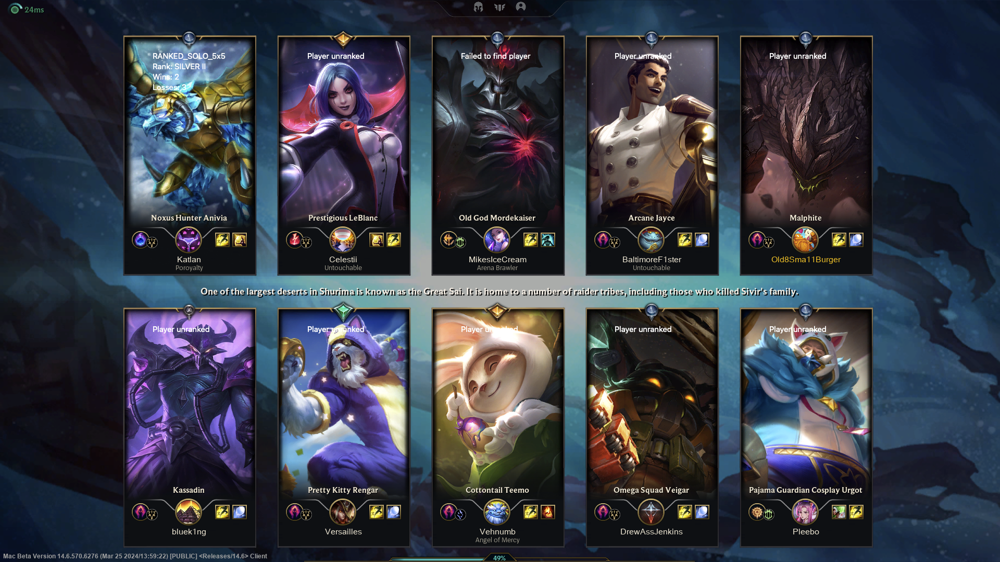

# LeagueStalk

A macOS software written in C++ / Objective-C to auto check everyone's ranks and other status while your League of Legends match loads

> Player ranks and stats are displayed on top of champion icons (unless unfound or unranked)